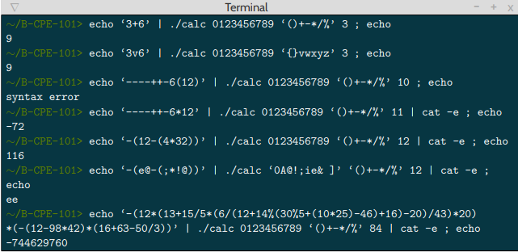
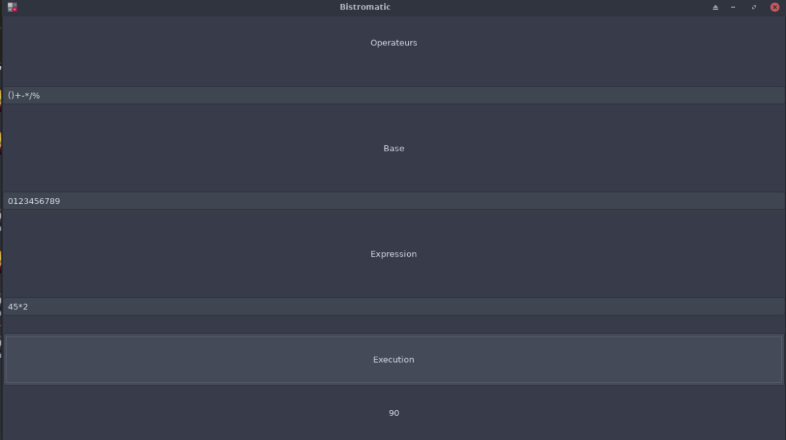

# Bistromatic

## Warning :warning:

I want to specify that for this project, we were beginners.\
I and David had started the programming 3 weeks ago,\
which explains a rough code and some memory errors. \
Despite that we got 100% in the correction.

## Description :sunrise_over_mountains:

The goal of this project is to write a program that will display the result of an evaluated mathematical expression.\
The expression will be composed of infinite integers that can be expressed in any base.\
The program must handle the following operators: +-*/%, parentheses, operation priorities and syntax errors,\
but not float numbers.

Most of the functions of the lib C were forbidden,\
we were allowed to use : write, exit, malloc, free and read



## Installation :mag_right:

```
 git clone https://github.com/Mikatech/Bistromatic.git
 cd Bistromatic
 make
```

## Results :trophy:

|                          Dependency                        |      License       |
|:----------------------------------------------------------:|:------------------:|
|           Syntax Errors | 12 / 12 |
| Addition    | 14 / 14        |
| Substraction          | 26 / 26        |
| Multiplication | 18 / 18  |
|Division|22 / 22|
|Modulo|22 / 22|
|Base & operators | 12 / 12 |
|Eval Expr| 24 / 24 |

## Bonus :package:

As a bonus, we have created a graphical interface using GTK




------------
## Maintainers :sunglasses:

 - [Mikaël Vallenet](https://github.com/Mikatech)
 - [David Gozlan](https://github.com/Davphla)
